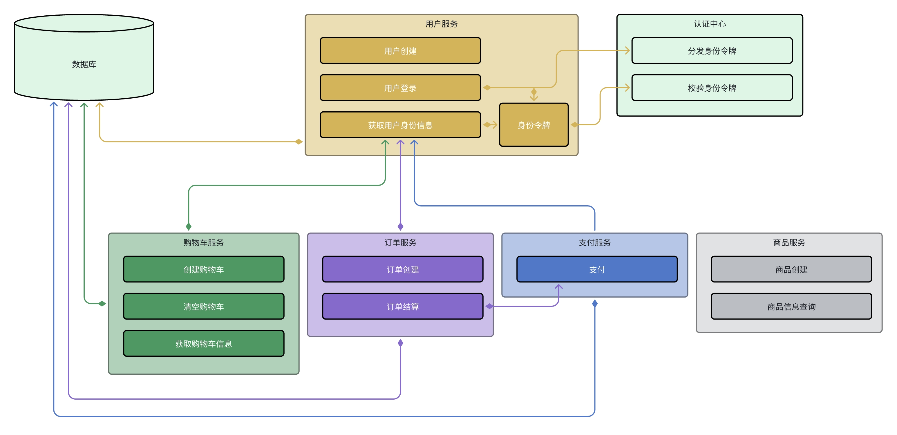

# dyshop

# Overview

## Content

- [How to Run](#how-to-run-thinking_face)
  - [Start a Microservice App](#start-a-microservice-app)
  - [Testing Microservice](#testing-microservice)
- [How to Collaborate](#how-to-collaborate)
- [Project Architecture](#project-architecture)
- [Framework](#framework)
- [Project Quick Start](#project-quick-start)
- [Front-end](#front-end)
- [Progress](#Progress)
  - [Framework](#framework-1)
  - [Auth](#auth)

# How to Run 🤔

## Start a Microservice App

`app`目录下的每一个目录都是一个微服务。微服务的运行方式都是相同的。

1. 进入微服务目录（以 auth 服务为例）

```shell
dyshop$ cd app/auth
```

2. 运行微服务程序

```shell
dyshop/app/auth$ go run .
```

> <strong>⚠ 注意：</strong>  
> 各个微服务请从自己的微服务目录中运行，不要在项目路径或其他路径中运行。  
> 微服务的搜索路径与起始路径有关，在其他地方运行服务，可能会导致<strong>`conf`文件读取错误 ❌</strong>或其他问题。

3. 微服务启动后，默认没有输出，但是会使终端处于阻塞状态。你可以自己控制微服务的输出。

## Testing Microservice

为了测试微服务是否可用，在本项目中有三种进行测试的方式。

1. 离线测试：  
   使用`go`的`go test` 编写 test 函数，进行离线测试。

```go
package service

// this file must end with _test.go
// for example: example_test.go
import (
	"testing"
)

// optional function
// if you have some common initialization operations
// for all test functions please write in this function
func init(){
	// init operations before test...
}

// TestXXX this function must start with Test
func TestXXX(t *testing.T) {
	// write your test code here...
}
```

运行 go test 的方式也比较简单

```shell
go test -run TestXXX -v # 运行某个测试函数，并且详细输出结果
go test -file example_test.go -v # 运行某个测试文件的所有测试函数
```

> 💡 这种方式能够在本地得到 service 函数的执行结果，并且可以设置测试样例，进行覆盖测试。  
> 💡 这也是一种在`非main包`情况下运行某个函数的方式。 2. 本地 RPC 调用测试  
>  我们已经提供了本地的 RPC 客户端的实现，就在当前微服务的 cmd/client 目录下。

```go
package main

import (
	"fmt"
	pbauth "github.com/asmile1559/dyshop/pb/backend/auth"
	// ...
)

func main() {
	// initialization operations
	cc, err := grpc.NewClient("localhost:"+viper.GetString("server.port"), grpc.WithTransportCredentials(insecure.NewCredentials()))
	if err != nil {
		logrus.Fatal(err)
	}
	cli := pbauth.NewAuthServiceClient(cc)
	// you can call your rpc functions here by grpc
	resp, err := cli.DeliverTokenByRPC(context.TODO(), &pbauth.DeliverTokenReq{UserId: 1})
	// other operations
}
```

执行命令如下：

```shell
# 1. start up microservice server
dyshop/app/auth$ go run .
# 2. open a new terminal and run client
dyshop/app/auth$ go run cmd/client/main.go
```

> ❗ 这种方式首先需要启动 RPC 服务，也即运行微服务本身。

3. 标准请求方式  
   标准请求方式是外部请求从浏览器发起，经过 frontend（gateway）进行转发处理，并最终将结果返回给浏览器的过程。  
   这是实际上我们最终需要实现的。  
   执行命令如下：

```shell
# 1. start up microservice server
dyshop/app/auth$ go run .
# 2. open a new terminal and start up frontend
dyshop/app/frontend$ go run .
# 3. request by browser, postman or curl
# recommend browser and postman
curl -X POST \
  -H "Content-Type: application/json" \
  -d '{"user_id": 1}' \
  http://localhost:10166/test/login
```

> 👍 推荐在进行最后功能测试时使用这种方式

# How to collaborate

0. 环境（框架功能的开发环境）,**一般情况下<font color="red">不需要</font>改自己的环境**

   > Go version: go1.23.5 linux/amd64  
   > IDE：GoLand/VSCode（VSCode 有时候会出现找不到模块的报错）  
   > OS：Linux/（Debian12，Ubuntu2204)

1. 将代码克隆到本地。**推荐使用 ssh 模式**。也可以 fork 之后 clone 自己的。

```shell
git clone git@github.com:asmile1559/dyshop.git
```

2. 新建一个分支

```shell
# example需要替换为自己负责的模块
git branch feat/example
git checkout feat/example
```

3. 安装 `protoc`, `protoc-gen-go`, `protoc-gen-go-grpc`.

```shell
# 1. 安装 protoc
# 参考 https://grpc.io/docs/protoc-installation/
PB_REL="https://github.com/protocolbuffers/protobuf/releases"
curl -LO $PB_REL/download/v29.3/protoc-29.3-linux-x86_64.zip
unzip protoc-29.3-linux-x86_64.zip -d $HOME/.local

# 可以写到 $HOME/.profile 或 $HOME/.bashrc 中
export PATH="$PATH:$HOME/.local/bin"

# 2. 安装 protoc-gen-go 和 protoc-gen-go-grpc
# 参考：https://grpc.io/docs/languages/go/quickstart/
go install google.golang.org/protobuf/cmd/protoc-gen-go@latest
go install google.golang.org/grpc/cmd/protoc-gen-go-grpc@latest

# 可以写到 $HOME/.profile 或 $HOME/.bashrc 中
export PATH="$PATH:$(go env GOPATH)/bin"
```

4. 生成 proto 文件，**可以不生成（当需要修改 proto 文件时，需要运行下面的命令）**

```shell
make gen-frontend-proto
make gen-backend-proto
```

5. 开始编写代码吧。

微服务的业务代码一般在下面三个文件中编写。

- `app/xxx/main.go`
- `app/xxx/handler.go`
- `app/xxx/service/*.go`

> 👍 推荐 **（不是硬性规定）** 👍
>
> - 😀 在 `app/xxx/main.go`文件中编写运行初始化、服务注册等部分代码。
> - 😁 在 `app/xxx/handler.go`中编写与 RPC 相关部分的代码。
> - 😊 在 `app/xxx/service/*.go`中编写具体的业务代码。
>
> 💡 `auth`部分的业务逻辑已经实现，如果需要编写自己部分的业务逻辑，可以参考。

6. 推送分支

```shell
# 追踪文件
git add .
# 本地提交
git commit -m "example commit"
# 如果是多人协调一个分支
git pull origin feat/example
# 本地处理冲突
...
# 推送到远端
git push origin feat/example
```

7. **发起一个 PR 请求**  
   你可以考虑自己自己与主分支 merge，也可以和别人进行 code review 后进行 merge。  
   推荐与别人讨论后再 merge。

# Project Architecture

```text
dyshop/ # 工程根目录
├── app # 微服务目录
│   ├── auth # 鉴权与认证服务
│   │   ├── biz # 业务代码
│   │   │   ├── dal # 数据库相关操作
│   │   │   ├── model # 模型定义
│   │   │   └── service # 服务代码
│   │   │       ├── deliver_token.go
│   │   │       ├── deliver_token_test.go
│   │   │       ├── verify.go
│   │   │       └── verify_test.go
│   │   ├── cmd # 客户端实现
│   │   │   └── client
│   │   │       └── main.go
│   │   ├── conf # 配置文件
│   │   │   ├── config.yaml
│   │   │   ├── model.conf
│   │   │   └── policy.csv
│   │   ├── docker-compose.yaml # 当前服务启动的容器
│   │   ├── go.mod
│   │   ├── go.sum
│   │   ├── handler.go # RPC相关代码
│   │   ├── main.go # 微服务入口
│   │   ├── middleware # 中间件函数
│   │   ├── script # 脚本
│   │   └── utils # 当前微服务使用的工具函数
│   ├── ... # 其他微服务
├── pb # protoc 生成的文件
│   ├── backend
│   ├── frontend
│   └── go.mod
├── proto # proto源文件
│   ├── backend
│   └── frontend
├── utils
│    ├── balancerx # 负载均衡
│    ├── configx # 配置
│    ├── ctool # 加密
│    ├── db # 数据库
│    ├── example # 示例
│    ├── filex # 文件操作
│    ├── registryx # 服务注册
│    ├── jwt # token
│    ├── logx # 日志
│    └── go.mod
├── assets # README.md 使用的资源目录
├── deploy # 微服务部署
├── README.md # 说明
├── dyshop.postman_collection.json # postman请求测试文件
├── go.work # workspace文件
└── Makefile # 常用命令
```

# Framework:



1. 外部请求通过 RESTful API 发送至 gateway(frontend)
2. 当一个 app 启动时，会向注册中心进行注册
3. 内部服务之间的访问，通过注册中心找到对应的服务，并通过 grpc 调用传输。
4. 建议每一个微服务使用自己独立的数据库，这样一方面加快数据库的查找速度，另一方面更加安全。

# Project Quick Start

1. 在 proto 目录下的前端和后端模块中，编写所需要的 proto 文件（或者修改原本的 proto 文件）。

```protobuf
syntax = "proto3"; // proto 协议版本 [required]

package hello; // 当前proto文件的包名，用于 proto 之间的 import [required]

// option go_package = "example.com/user/project/whatever;whatever"
//   ↑        ↑                      ↑              ↑        ↑
// proto选项 | 生成的 go 包的参数   按照项目填写      生成go包名 |其他包的引用名
// ⚠注意：生成的go包路是 go_out 路径加 example.com/user/project/whatever/**.go
option go_package = "github.com/asmile1559/dyshop/pb/backend/hello;hello";

// The greeter service definition.
service Greeter {
//       ↑
//  service的名字，一个大的service有很多小的rpc调用（小的service）
//  这里的service会由grpc提供 client 和 server 接口
  rpc SayHello (HelloRequest) returns (HelloReply) {}
// ↑     ↑           ↑           ↑         ↑        ↑
//声明rpc|RPC调用名|RPC调用参数|声明返回值|RPC调用返回值|可拓展参数
}

// The request message containing the user's name.
message HelloRequest {
// ↑         ↑
//声明消息   消息名，对应调用参数和返回值
  string name = 1;
//  ↑     ↑     ↑
// 类型  参数名 序列号
}

// The response message containing the greetings
message HelloReply {
  string message = 1;
}
```

2. 在工程目录下，运行 `make gen-backend-proto` 或者 `make gen-frontend-proto`。它会在 pb 目录下的对应位置生成你需要的 go 文件。
3. 在 app 目录下找到或者新建你的微服务。如 `auth`。并按照 project architecture 的结构创建文件。
4. 模仿某一个 app 的`biz/service`的内容编写自己的 service，最好添加测试，可以测试自己`service`的可用性。推荐的写法如下：

```go
package service

import (
    pbhello "github.com/asmile1559/dyshop/pb/backend/hello"
    "context"
)

type SayHelloService struct {
	ctx context.Context
}

func NewSayHelloService(c context.Context) *SayHelloService {
	return &SayHelloService{ctx: c}
}

func (s *SayHelloService) Run(req *pbhello.HelloRequest) (*pbhello.HelloReply, error) {
	// TODO: finish your business code...
	//
    return
}


```

5. 在 handler 中实现对应 rpc 的方法。

```go
package main

// 1. 导入对应的依赖
import (
    "context"
	// service 是自己实现的service
    service "github.com/asmile1559/dyshop/app/hello/biz/service"
	// pbhello 是 protoc 生成的的文件
    pbhello "github.com/asmile1559/dyshop/pb/backend/hello"
)

type Greeter struct{
	// 包含这个未实现的 server 即可
	pbhello.UnimplementedGreeterServer
}

func (s *Greeter) SayHello(ctx context.Context, req *pbhello.HelloRequest) (*pbhello.HelloReply, error) {
	// 这一部分可以根据自己的需求修改
	// 如果不想调用 service 也可以直接在这里完成 RPC 的所有请求和响应
	resp, err := service.NewSayHelloService(ctx).Run(req)
	return resp, err
}
```

6. 在`app/frontend/biz/handler`和`app/frontend/biz/service`完成类似的代码。
7. 在`app/frontend/biz/router`中的模块中添加对应的路由。
8. 在`app/frontend/rpc/client.go`中添加 rpc client 的全局变量。具体写法可以参照其他变量修改。
9. 完善前端页面。

# Front-end

## 前端页面结构

前端页面均放在 app/frontend/templates 中，对应的 css/js/图片文件存放在 app/frontend/static 中

1. index.html: 主页
2. user.html: 用户页面
3. cart.html: 购物车页面
4. order.html: 订单页面
5. payment.html: 支付页面
6. search.html: 搜索结果页面
7. product-page.html: 商品详情页
8. register.html: 注册页面
9. login.html: 登录页面
10. pong.html: Ping-Pong 测试页面

## 后端如何响应前端页面

浏览器会向后端发起 GET 请求, 以获取页面. 后端需要响应前端请求, 提供后端数据. 所有的数据均需要通过 gin 接口进行传递, 其基本方式是:
`c.HTML(http.StatusOk, "xxx.html", gin.H{xxx})` 或 `c.HTML(http.StatusOk, "xxx.html", &yourStruct)`.\
在 app/frontend/main.go 中的 ping 响应为例子

```go
router.GET("/ping", func(c *gin.Context) {
  //  1. 方式 1
  resp := struct {
  Code int    `json:"code"`
  Host string `json:"host"`
  Pong string `json:"pong"`
  }{http.StatusOK, "192.168.191.130:10166", "Pong"}
  c.HTML(http.StatusOK, "pong.html", &resp)
  // 2. 方式 2
  c.HTML(http.StatusOK, "pong.html", gin.H{
  "Code": http.StatusOK,
  "Host": "192.168.191.130:10166",
  "Pong": "Pong",
  })
})
```

## 前端的请求参数和响应参数

前端的请求参数和响应均在`app/frontend/example.go`中, 在实际使用时, 需要将 `app/frontend/predef.go` 中的参数和 `app/frontend/static/js/router.js` 的路径.

现在的路径为

```js
// app/frontend/static/js/router.js
const DefaultURL = "http://192.168.191.130:10166";

const OperationRouters = {
  home: "/example/", // GET
  switchShowcase: "/example/showcase/", // GET
  updateUserInfo: "/example/user/info/", // POST
  updateUserImg: "/example/user/info/upload/", // POST
  registerMerchant: "/example/user/role/merchant/", // GET
  updateUserAccount: "/example/user/account/", // POST
  deleteUserAccount: "/example/user/account/delete/", // POST
  updateAddress: "/example/user/address/", // POST
  deleteAddress: "/example/user/address/delete/", // POST
  setDefAddress: "/example/user/address/setDefault/", // POST
  updateProduct: "/example/user/product/", // POST
  deleteProduct: "/example/user/product/delete/", // POST
  getProduct: "/example/product/", // GET
  buy: "/example/product/buy/", // POST
  addToCart: "/example/product/add2cart/", // POST
  getCart: "/example/cart/", // GET
  deleteCartItem: "/example/cart/delete/", // POST
  cartCheckout: "/example/cart/checkout/", // POST
  getOrder: "/example/order/", // GET
  cancelOrder: "/example/order/cancel/", // POST
  submitOrder: "/example/order/submit/", // POST
  checkout: "/example/checkout/", // GET
  cancelCheckout: "/example/checkout/cancel/", // POST
  payment: "/example/payment/", // POST
  search: "/example/search/", // GET
  register: "/example/user/register/", // GET|POST
  login: "/example/user/login/", // GET|POST
  verify: "/example/verify/", // POST
};
```

```go
// predef.go
package main

import "github.com/gin-gonic/gin"

var (
	pageRouter = gin.H{
		"HomePage":     "/example/",
		"LoginPage":    "/example/user/login/",
		"RegisterPage": "/example/user/register/",
		"UserPage":     "/example/user/",
		"ProductPage":  "/example/product/",
		"OrderPage":    "/example/order/",
		"CartPage":     "/example/cart/",
		"SearchPage":   "/example/search/",
		"PaymentPage":  "/example/payment/",
	}
)
```

# Progress

## Framework

- [x] 前端路由（提供的路由接口框架基本完成，缺少前端页面的配合）
- [x] 后端各模块的 rpc 通信接口（提供的 rpc 通信接口已完成，位于 handler.go 文件）
- [x] 日志（日志初始化函数）
- [x] 数据库（数据库开启函数）
- [x] 加密算法
  - [x] 加盐的密码加密算法
- [x] config（基于 etcd 的参数保存、取用和 watch）
- [x] 服务注册与发现（基于 etcd 的服务注册模块已经完成）
  - [x] etcd
  - [ ] <del>consul</del>
- [x] 鉴权和认证
  - [x] jwt
  - [x] casbin
  - [ ] <del>satoken<del>
- [ ] 负载均衡
- [ ] 前端页面
- [ ] 可观测性
  - [x] 日志（日志初始化函数）
  - [x] Metrics：Prometheus (with auto detection service)
  - [ ] Trace

## Auth

- [x] rpc 通信
- [x] Token 的生成与分发
- [x] Token 验证，并通过 casbin 进行访问控制
- [ ] 服务注册
